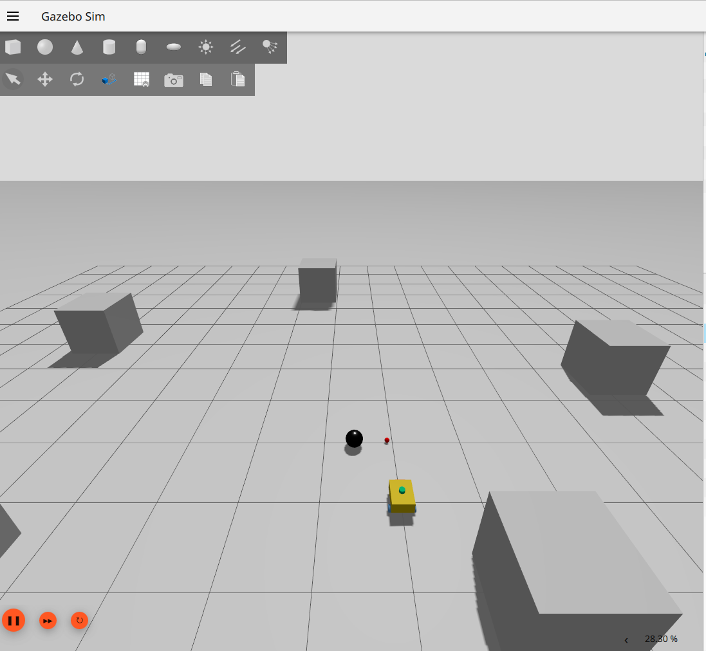
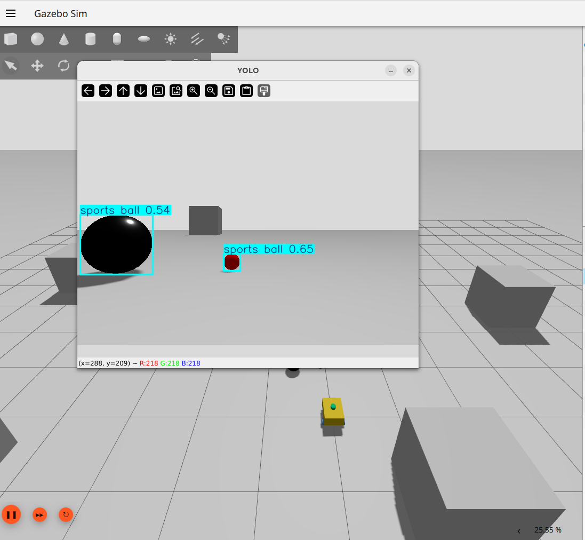

# Mobile Robot with Vision

A mobile robot system enhanced with computer vision, capable of perceiving its environment using a camera and performing tasks such as object detection, tracking, and visual-based navigation.

This project combines robotics, ROS 2, and deep learning to demonstrate how vision can be integrated into a real or simulated mobile robot.

## Features

- Mobile robot platform (simulation or real robot)
- Camera-based perception
- Object detection using deep learning (e.g. YOLO)

## Technology Stack

- ROS 2 Jazzy
- Python / C++
- OpenCV
- Deep Learning Object Detection
- YOLO (Ultralytics / ONNX / OpenCV DNN)
- Gazebo (Harmonic) for simulation
- RViz2 for visualization

## Getting Started
### Prerequisites
1. Ubuntu 22.04+
2. ROS 2 installed
3. Python 3.10+
4. OpenCV
5. CUDA (optional, for GPU acceleration)

### Steps
1. Clone the Repository
```
cd ros2_ws
colcon build
source install/setup.bash
```
2. Build the Workspace
```
cd ros2_ws
colcon build
source install/setup.bash
```
3. Run the Robot (Simulation)
```
ros2 launch robot_simulation simulation.launch.py
```
4. Bride the image
```
ros2 launch robot_vision camera_and_points_bridge.launch.py
```
5. YOLO
```
ros2 run yolo_pkg yolo_node
```

## Screenshots




---